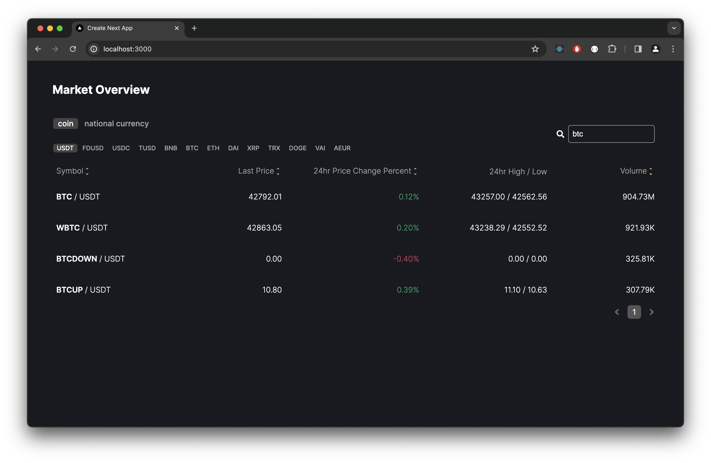
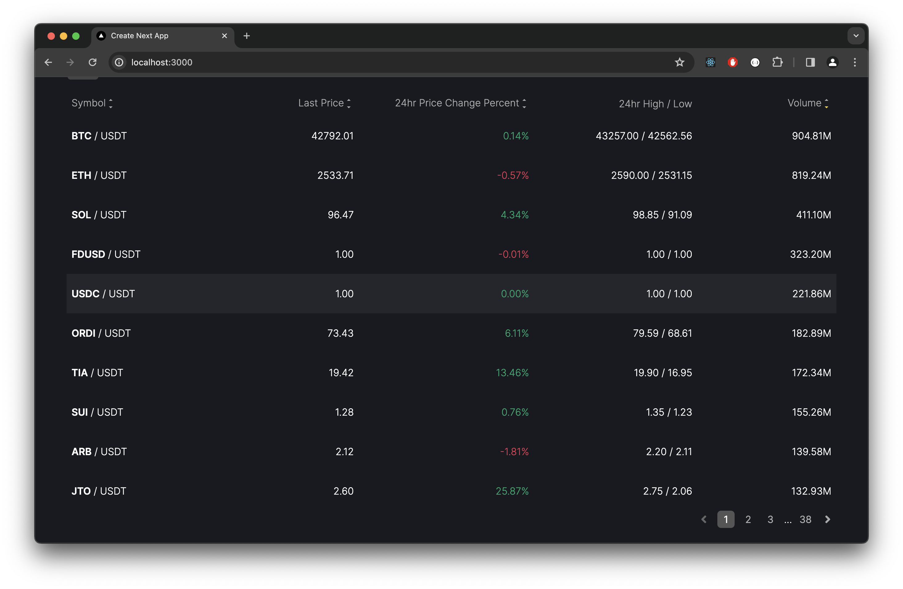
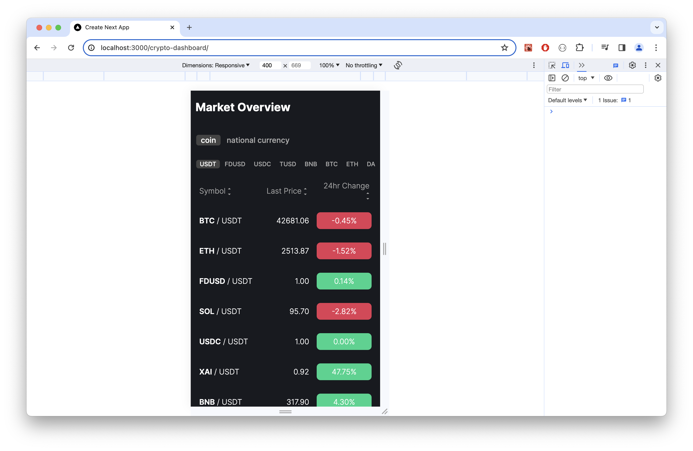

# Crypto Dashboard

[Demo](https://zi-shane.github.io/crypto-dashboard/)

**Note: There is reload issue on github page. Running at local server will be normal.**

Crypto protucts dashboard can sort and search.

## Features

- Get products from API and update latest data from WebSocket.
- Filter by quote and keyword
- Display 10 items each page
- Support RWD
- Update query parameters when selecting filter tag.

## Getting Started

First, run the development server:

```bash
npm run dev
```

Open [http://localhost:3000](http://localhost:3000) with your browser to see the result.

## Snapshot




